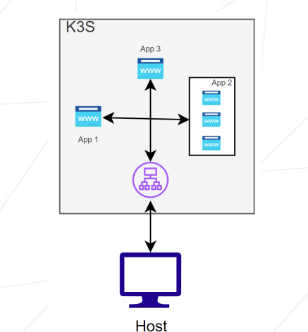
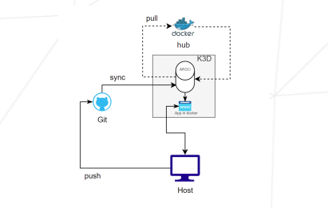

# 🚀 Inception-of-Things (IoT)

Welcome to **Inception-of-Things**, a deep dive into the world of **lightweight Kubernetes**! This project blends system administration, virtualization, and DevOps automation using tools like **K3s**, **K3d**, **Vagrant**, and **Argo CD**.

Whether you're just getting started with Kubernetes or want to strengthen your infrastructure knowledge, this project has got you covered — from setting up VMs with Vagrant, running services with K3s, to deploying apps continuously using Argo CD and GitHub.

---

## 📦 Project Structure


---

## 🧩 Part 1 – K3s & Vagrant: Building the Foundation

> 📁 Folder: `p1/`

- Provision two lightweight virtual machines using **Vagrant**.
- Configure static IPs, SSH access, and minimal resources (1 CPU, 512–1024MB RAM).
- Install **K3s**:
  - `Server` node as the control plane.
  - `Worker` node as the agent.
- Use `kubectl` to interact with the cluster.
  
This part simulates a mini on-premise cluster environment. 💻
<!-- add image from assest -->

---

## 🌐 Part 2 – K3s & Three Applications: Learning Ingress & Replication

> 📁 Folder: `p2/`

- Deploy **3 custom web applications** on your K3s instance.
- Use **Ingress** to route based on the `HOST` header:
  - `app1.com` → Application 1
  - `app2.com` → Application 2 (with **3 replicas**)
  - Anything else → Application 3
- Demonstrates service exposure, load balancing, and replication.

This part is your intro to **application routing and scaling** in Kubernetes. 🌍

---

## 🔁 Part 3 – K3d & Argo CD: Continuous Deployment Magic

> 📁 Folder: `p3/`

- Switch to **K3d**, a Docker-based Kubernetes setup.
- Install and configure **Argo CD** in a dedicated namespace.
- Deploy your application **automatically from GitHub** using Argo CD.
- Support **two versions** (`v1` and `v2`) of your app, pushed to DockerHub.

Make a code change ➜ push to GitHub ➜ Argo CD syncs and deploys it 🚀


---

## ⭐ Bonus – GitLab Integration

> 📁 Folder: `bonus/`

- Deploy a **self-hosted GitLab** instance within your K3d cluster.
- Use Helm or other tools to manage the deployment.
- Create a new namespace `gitlab`, and ensure your full CI/CD pipeline works with GitLab as the Git source.

This bonus takes it to the next level: **local DevOps with GitLab**. 💼
---

## 🛠 Technologies Used

- 🐳 Docker
- 🧪 Kubernetes (K3s & K3d)
- 🧭 Argo CD
- 📦 Vagrant
- 🐙 GitHub
- 💥 GitLab (Bonus)
- ☁️ Ingress Controllers

---

## 📂 Repository Rules

- All code/configs are grouped in the respective `p1`, `p2`, `p3`, and `bonus` folders.
- Each folder contains:
  - `scripts/`: Setup and install scripts
  - `confs/`: YAMLs, manifests, and configuration files
  - `Vagrantfile`: (when applicable)

---

## 🧪 How to Try It

> You can clone the repository and go step-by-step through each part.

```bash
git clone https://github.com/your-username/inception-of-things.git
cd inception-of-things
cd P1 P2 Vagrant up
cd P3 && ./setup.sh && ./build.sh
